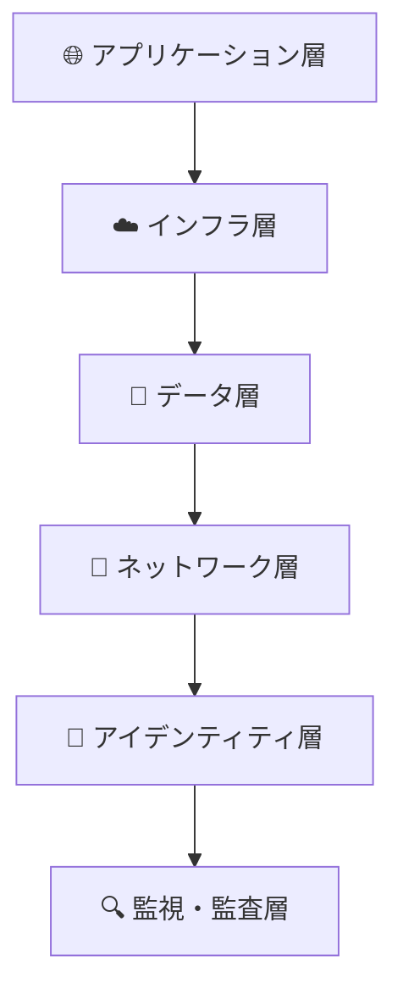

# 🛡️ 塩尻レインボーシーカー セキュリティガイド

[](docs/SECURITY.md)
[](https://owasp.org/www-project-top-ten/)
[](https://www.iso.org/isoiec-27001-information-security.html)
[](https://en.wikipedia.org/wiki/Advanced_Encryption_Standard)

## 📋 概要
塩尻レインボーシーカープロジェクトの**エンタープライズグレードセキュリティ対策**とガイドラインです。多層防御とゼロトラストアーキテクチャによる堅牢なセキュリティを実現します。

## 🎯 セキュリティフレームワーク

### 🔐 セキュリティ原則
| 原則 | 説明 | 実装 |
|------|------|------|
| **🔒 ゼロトラスト** | 何も信頼せず、すべてを検証 | 多要素認証・継続的検証 |
| **🛡️ 最小権限** | 必要最小限のアクセス権限 | RBAC・動的権限管理 |
| **🌊 多層防御** | 複数のセキュリティ層で保護 | WAF・IDS・暗号化 |
| **📊 継続監視** | リアルタイム脅威検知 | SIEM・異常検知・アラート |
| **🔄 自動化** | セキュリティプロセス自動化 | DevSecOps・自動パッチ |

### 🎯 セキュリティ適用範囲


### 🏛️ コンプライアンス対応
- ✅ **OWASP Top 10** 完全対応
- ✅ **ISO 27001** セキュリティ管理
- ✅ **NIST フレームワーク** 準拠
- ✅ **GDPR** データ保護規制対応
- ✅ **日本個人情報保護法** 対応

## 認証・認可

### 1. ユーザー認証

#### JWT認証
```javascript
// JWT設定
const jwt = require('jsonwebtoken');

const generateToken = (user) => {
  return jwt.sign(
    { 
      id: user.id, 
      email: user.email,
      role: user.role 
    },
    process.env.JWT_SECRET,
    { 
      expiresIn: '24h',
      issuer: 'shiojiri-rainbow-seeker',
      audience: 'api-users'
    }
  );
};
```

#### パスワードポリシー
```javascript
// パスワード要件
const passwordPolicy = {
  minLength: 8,
  requireUppercase: true,
  requireLowercase: true,
  requireNumbers: true,
  requireSpecialChars: true,
  maxAge: 90, // 日数
  historyCount: 5 // 過去のパスワード記録数
};
```

#### 多要素認証（MFA）
```javascript
// TOTP実装
const speakeasy = require('speakeasy');

const generateMFASecret = () => {
  return speakeasy.generateSecret({
    name: 'Shiojiri Rainbow Seeker',
    issuer: 'Shiojiri City',
    length: 32
  });
};
```

### 2. API認証

#### API キー管理
```javascript
// API キー検証
const validateApiKey = (req, res, next) => {
  const apiKey = req.headers['x-api-key'];
  
  if (!apiKey) {
    return res.status(401).json({ error: 'API key required' });
  }
  
  // API キーの検証ロジック
  if (!isValidApiKey(apiKey)) {
    return res.status(401).json({ error: 'Invalid API key' });
  }
  
  next();
};
```

#### レート制限
```javascript
// Express rate limiter
const rateLimit = require('express-rate-limit');

const limiter = rateLimit({
  windowMs: 15 * 60 * 1000, // 15分
  max: 100, // 最大リクエスト数
  message: 'Too many requests from this IP',
  standardHeaders: true,
  legacyHeaders: false,
});
```

## データ保護

### 1. 暗号化

#### 保存時暗号化
```javascript
// データベース暗号化
const crypto = require('crypto');

const encrypt = (text, key) => {
  const algorithm = 'aes-256-gcm';
  const iv = crypto.randomBytes(16);
  const cipher = crypto.createCipher(algorithm, key, iv);
  
  let encrypted = cipher.update(text, 'utf8', 'hex');
  encrypted += cipher.final('hex');
  
  const authTag = cipher.getAuthTag();
  
  return {
    encrypted: encrypted,
    iv: iv.toString('hex'),
    authTag: authTag.toString('hex')
  };
};
```

#### 通信暗号化
```yaml
# Kubernetes TLS設定
apiVersion: v1
kind: Secret
metadata:
  name: api-tls
  namespace: shiojiri-rainbow-seeker
type: kubernetes.io/tls
data:
  tls.crt: <base64-encoded-cert>
  tls.key: <base64-encoded-key>
```

### 2. 個人情報保護

#### データマスキング
```javascript
// 個人情報マスキング
const maskPersonalData = (data) => {
  return {
    ...data,
    email: data.email.replace(/(.{2}).*@/, '$1***@'),
    phone: data.phone.replace(/(\d{3})-(\d{4})-(\d{4})/, '$1-****-$3'),
    location: {
      latitude: Math.round(data.location.latitude * 100) / 100,
      longitude: Math.round(data.location.longitude * 100) / 100
    }
  };
};
```

#### データ保持期間
```javascript
// 自動データ削除
const cleanupOldData = async () => {
  const retentionDays = {
    access_logs: 90,
    user_activities: 365,
    sightings: 1095 // 3年
  };
  
  for (const [table, days] of Object.entries(retentionDays)) {
    await db.query(`
      DELETE FROM ${table} 
      WHERE created_at < NOW() - INTERVAL '${days} days'
    `);
  }
};
```

## 入力検証

### 1. パラメータ検証
```javascript
// Joi バリデーション
const Joi = require('joi');

const sightingSchema = Joi.object({
  location: Joi.object({
    latitude: Joi.number().min(-90).max(90).required(),
    longitude: Joi.number().min(-180).max(180).required()
  }).required(),
  description: Joi.string().max(1000).required(),
  image_url: Joi.string().uri().required()
});
```

### 2. SQLインジェクション対策
```javascript
// パラメータ化クエリ
const getSightings = async (userId, limit, offset) => {
  const query = `
    SELECT * FROM sightings 
    WHERE user_id = $1 
    ORDER BY created_at DESC 
    LIMIT $2 OFFSET $3
  `;
  
  return await db.query(query, [userId, limit, offset]);
};
```

### 3. XSS対策
```javascript
// サニタイゼーション
const sanitizeHtml = require('sanitize-html');

const sanitizeUserInput = (input) => {
  return sanitizeHtml(input, {
    allowedTags: [],
    allowedAttributes: {},
    disallowedTagsMode: 'escape'
  });
};
```

## インフラセキュリティ

### 1. コンテナセキュリティ

#### セキュアDockerfile
```dockerfile
# セキュアなベースイメージ
FROM node:18-alpine

# 非rootユーザー作成
RUN addgroup -g 1001 -S nodejs
RUN adduser -S nextjs -u 1001

# 不要なパッケージ削除
RUN apk del .gyp

# セキュリティアップデート
RUN apk update && apk upgrade

# 権限設定
USER nextjs
```

#### イメージスキャン
```bash
# Trivy スキャン
trivy image --severity HIGH,CRITICAL your-registry/shiojiri-rainbow-seeker-backend:latest

# 脆弱性レポート
trivy image --format json --output report.json your-registry/shiojiri-rainbow-seeker-backend:latest
```

### 2. Kubernetes セキュリティ

#### Pod Security Standards
```yaml
# Pod Security Policy
apiVersion: v1
kind: Namespace
metadata:
  name: shiojiri-rainbow-seeker
  labels:
    pod-security.kubernetes.io/enforce: restricted
    pod-security.kubernetes.io/audit: restricted
    pod-security.kubernetes.io/warn: restricted
```

#### RBAC設定
```yaml
# Service Account
apiVersion: v1
kind: ServiceAccount
metadata:
  name: backend-service-account
  namespace: shiojiri-rainbow-seeker

---
# Role
apiVersion: rbac.authorization.k8s.io/v1
kind: Role
metadata:
  name: backend-role
  namespace: shiojiri-rainbow-seeker
rules:
- apiGroups: [""]
  resources: ["pods", "configmaps", "secrets"]
  verbs: ["get", "list"]

---
# RoleBinding
apiVersion: rbac.authorization.k8s.io/v1
kind: RoleBinding
metadata:
  name: backend-binding
  namespace: shiojiri-rainbow-seeker
subjects:
- kind: ServiceAccount
  name: backend-service-account
  namespace: shiojiri-rainbow-seeker
roleRef:
  kind: Role
  name: backend-role
  apiGroup: rbac.authorization.k8s.io
```

#### Network Policy
```yaml
# ネットワーク分離
apiVersion: networking.k8s.io/v1
kind: NetworkPolicy
metadata:
  name: backend-network-policy
  namespace: shiojiri-rainbow-seeker
spec:
  podSelector:
    matchLabels:
      app: backend
  policyTypes:
  - Ingress
  - Egress
  ingress:
  - from:
    - podSelector:
        matchLabels:
          app: frontend
    ports:
    - protocol: TCP
      port: 3000
  egress:
  - to:
    - podSelector:
        matchLabels:
          app: postgres
    ports:
    - protocol: TCP
      port: 5432
```

## 監視・ログ

### 1. セキュリティ監視

#### 不正アクセス検知
```javascript
// 異常なログイン試行検知
const detectBruteForce = (ip, attempts) => {
  const threshold = 5;
  const timeWindow = 5 * 60 * 1000; // 5分
  
  if (attempts >= threshold) {
    // IP をブロック
    blockIP(ip, timeWindow);
    
    // アラート送信
    sendSecurityAlert('Brute force attack detected', { ip, attempts });
  }
};
```

#### セキュリティイベントログ
```javascript
// セキュリティログ
const logSecurityEvent = (event, details) => {
  const logEntry = {
    timestamp: new Date().toISOString(),
    event: event,
    details: details,
    severity: getSeverityLevel(event),
    source_ip: details.ip,
    user_agent: details.userAgent
  };
  
  // SIEM に送信
  sendToSIEM(logEntry);
};
```

### 2. ログ分析

#### 異常検知
```bash
# 異常なアクセスパターン検知
kubectl logs deployment/backend -n shiojiri-rainbow-seeker | \
  grep -E "(401|403|429)" | \
  awk '{print $1}' | \
  sort | uniq -c | sort -nr | head -10

# SQLインジェクション試行検知
kubectl logs deployment/backend -n shiojiri-rainbow-seeker | \
  grep -i -E "(union|select|insert|update|delete|drop|exec)" | \
  grep -v "normal_query"
```

## 脆弱性管理

### 1. 依存関係管理

#### 脆弱性スキャン
```bash
# Node.js 依存関係
npm audit --audit-level high

# Python 依存関係
pip-audit --desc --format=json

# Docker イメージ
docker run --rm -v $(pwd):/app securecodewarrior/docker-security-checker /app/Dockerfile
```

#### 自動更新設定
```yaml
# Dependabot設定
version: 2
updates:
  - package-ecosystem: "npm"
    directory: "/backend"
    schedule:
      interval: "weekly"
    
  - package-ecosystem: "pip"
    directory: "/ml-system"
    schedule:
      interval: "weekly"
```

### 2. セキュリティパッチ

#### 定期更新手順
```bash
#!/bin/bash
# security_update.sh

# 1. 脆弱性スキャン
echo "Running security scan..."
npm audit --audit-level high

# 2. パッチ適用
echo "Applying security patches..."
npm audit fix

# 3. テスト実行
echo "Running tests..."
npm test

# 4. デプロイ
echo "Deploying updates..."
kubectl rollout restart deployment/backend -n shiojiri-rainbow-seeker
```

## アクセス制御

### 1. ファイアウォール設定

#### AWS Security Group
```yaml
# Terraform設定
resource "aws_security_group" "backend" {
  name = "backend-sg"
  
  ingress {
    from_port   = 443
    to_port     = 443
    protocol    = "tcp"
    cidr_blocks = ["0.0.0.0/0"]
  }
  
  ingress {
    from_port   = 80
    to_port     = 80
    protocol    = "tcp"
    cidr_blocks = ["0.0.0.0/0"]
  }
  
  egress {
    from_port   = 0
    to_port     = 0
    protocol    = "-1"
    cidr_blocks = ["0.0.0.0/0"]
  }
}
```

#### GCP Firewall
```yaml
# firewall-rules.yaml
resource "google_compute_firewall" "backend" {
  name    = "backend-firewall"
  network = "default"

  allow {
    protocol = "tcp"
    ports    = ["443", "80"]
  }

  source_ranges = ["0.0.0.0/0"]
  target_tags   = ["backend"]
}
```

### 2. VPN設定

#### WireGuard設定
```conf
# wg0.conf
[Interface]
PrivateKey = <private-key>
Address = 10.0.0.1/24
ListenPort = 51820

[Peer]
PublicKey = <public-key>
AllowedIPs = 10.0.0.2/32
Endpoint = <endpoint>:51820
```

## 災害復旧

### 1. バックアップ暗号化

#### 暗号化バックアップ
```bash
# GPGでバックアップ暗号化
gpg --symmetric --cipher-algo AES256 --compress-algo 1 backup.sql

# 暗号化されたバックアップのアップロード
aws s3 cp backup.sql.gpg s3://secure-backup-bucket/
```

### 2. 復旧手順

#### 緊急時復旧
```bash
#!/bin/bash
# emergency_recovery.sh

# 1. 最新バックアップダウンロード
aws s3 cp s3://secure-backup-bucket/latest-backup.sql.gpg ./

# 2. 復号化
gpg --decrypt latest-backup.sql.gpg > latest-backup.sql

# 3. データベース復旧
kubectl exec -i postgres-pod -n shiojiri-rainbow-seeker -- psql < latest-backup.sql

# 4. 整合性チェック
kubectl exec -it postgres-pod -n shiojiri-rainbow-seeker -- psql -c "SELECT COUNT(*) FROM sightings;"
```

## コンプライアンス

### 1. データ保護規制

#### GDPR対応
```javascript
// データ削除要求対応
const deleteUserData = async (userId) => {
  const transactions = await db.transaction();
  
  try {
    // 関連データ削除
    await transactions.query('DELETE FROM sightings WHERE user_id = $1', [userId]);
    await transactions.query('DELETE FROM user_activities WHERE user_id = $1', [userId]);
    await transactions.query('DELETE FROM users WHERE id = $1', [userId]);
    
    await transactions.commit();
    
    // 削除ログ
    logDataDeletion(userId);
    
  } catch (error) {
    await transactions.rollback();
    throw error;
  }
};
```

### 2. 監査ログ

#### 操作ログ記録
```javascript
// 監査ログ
const auditLogger = (action, resource, user, details) => {
  const auditEntry = {
    timestamp: new Date().toISOString(),
    action: action,
    resource: resource,
    user: user,
    details: details,
    ip: details.ip,
    user_agent: details.userAgent
  };
  
  // 監査ログデータベースに記録
  auditDB.insert('audit_logs', auditEntry);
};
```

## セキュリティテスト

### 1. 脆弱性テスト

#### OWASP ZAP
```bash
# 自動化されたセキュリティテスト
zap-baseline.py -t https://api.shiojiri-rainbow-seeker.com \
  -g gen.conf \
  -r baseline-report.html
```

#### Burp Suite
```bash
# API テスト
burp-rest-api-scanner --url https://api.shiojiri-rainbow-seeker.com \
  --output burp-report.json
```

### 2. ペネトレーションテスト

#### 定期テスト計画
```bash
#!/bin/bash
# monthly_pentest.sh

# 1. 自動化されたテスト
echo "Running automated security tests..."
zap-baseline.py -t https://api.shiojiri-rainbow-seeker.com

# 2. 手動テスト
echo "Running manual tests..."
# SQLインジェクション テスト
# XSS テスト
# 認証バイパス テスト

# 3. レポート生成
echo "Generating security report..."
generate-security-report.py
```

## セキュリティ教育

### 1. 開発者教育

#### セキュアコーディング
- OWASP Top 10 の理解
- 入力検証の実装
- 暗号化の適切な使用
- セキュリティテストの実施

#### 教育資料
- [OWASP セキュアコーディングガイド](https://owasp.org/www-project-secure-coding-practices-quick-reference-guide/)
- [セキュリティテストガイド](./SECURITY_TESTING.md)

### 2. インシデント対応

#### 対応手順
1. インシデント検知
2. 影響範囲の特定
3. 封じ込め
4. 根本原因分析
5. 復旧
6. 教訓の共有

## 連絡先

### セキュリティチーム
- **CISO**: ciso@shiojiri-rainbow-seeker.com
- **セキュリティエンジニア**: security@shiojiri-rainbow-seeker.com
- **インシデント対応**: incident@shiojiri-rainbow-seeker.com

### 脆弱性報告
- **バグバウンティ**: bugbounty@shiojiri-rainbow-seeker.com
- **責任ある開示**: disclosure@shiojiri-rainbow-seeker.com

## 参考資料
- [OWASP](https://owasp.org/)
- [NIST Cybersecurity Framework](https://www.nist.gov/cyberframework)
- [ISO 27001](https://www.iso.org/isoiec-27001-information-security.html)
- [Kubernetes Security Guide](https://kubernetes.io/docs/concepts/security/)